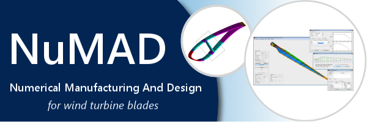

 
# Numerical Manufacturing And Design (NuMAD) Tool 
NuMAD (Numerical Manufacturing And Design) is an object-oriented, open-source software program written in Matlab which simplifies the process of creating a three-dimensional model of a wind turbine blade. The tool manages all blade information including aerodynamic, and material properties as well as, material placement. The blade information can be modified by a structural-optimizer in NuMAD or it can be used to run other tools in a stand-alone mode:

    The ANSYS® commercial finite element package
    The NWTC codes PreComp, BModes, and FAST
    PLOT3D file format for CFD mesh building

When used in conjunction with these other tools, NuMAD provides computation of blade cross section properties, various structural analyses, and estimation of blade aeroelastic instability. 

For any questions or to request more information, send an e-mail to: numad@sandia.gov

## Source
- **toolbox**: contains basic functions and operations needed for performing analysis with packages such as precomp, BPE, and ANSYS
- **objects**: contains the class definition of the blade object, which stores the geometric, airfoil and material data for a given blade design
- **optimization**: contains bundles of tools for several purposes, including ``runIEC``, file processing functions for input and output from other programs such as FAST and Crunch, and setup and execution of ANSYS models for analyzing quantities like material rupture, fatigue, and buckling under loading

## Examples

Example YMAL files can be located in the [examples](https://github.com/sandialabs/NuMAD/tree/main/examples) folder on GitHub. 

  
## License

NuMAD is licensed under BSD 3-clause license. Please see the
[LICENSE](https://github.com/sandialabs/NuMAD/blob/main/LICENSE) included in
the source code repository for more details.

## Acknowledgements 

NuMAD is currently being developed with funding from Department of Energy's
(DOE) Energy Efficiency and Renewable Energy (EERE) Wind Energy Technology Office (WETO). 
